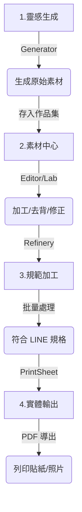

# ✨ Sticker Universe (CreativeOS)

[](https://opensource.org/licenses/MIT)


> **Sticker Universe (CreativeOS)** is a unified creative suite for designing, generating, and packaging digital content. It consolidates AI generation, image processing, background removal, and creative layouts into a single powerful web application.
>
> **Sticker Universe (CreativeOS)** 是一個專為創作者打造的綜合創意套件。它將 AI 生成、圖片編輯、自動去背、拼貼排版等功能整合在一個強大的網頁應用中。

---

## 📑 Table of Contents / 目錄

- [✨ 功能分類 / Features](#-功能分類--features)
- [🛠️ 安裝說明 / Installation](#️-安裝說明--installation)
- [📖 使用指南 / Usage Guide](#-使用指南--usage-guide)
- [🔧 技術棧 / Tech Stack](#-技術棧--技術棧)
- [📝 授權 / License](#-授權--license)

---

## ✨ 功能分類 / Features

### 1. AI 智慧生成 (AI Generation)

運用 Google Gemini AI 技術，將文字創意瞬間轉化為視覺成品。

- **風格貼圖**：輸入文字，AI 自動生成台灣風格、動漫風等多樣化貼圖。
- **節慶貼圖**：為各種節日（如春節、中秋）快速製作應景的貼圖包。
- **賀卡大師**：AI 協助設計精美節日賀卡，並提供智能配文潤飾。
- **漫畫大師**：將照片轉換為高品質的漫畫風格圖片，支援多種藝術流派。
- **影劇海報**：製作具有電影規格質感的創意海報與專業排版。
- **AI 圖片生成**：通用型 AI 繪圖工具，支援高解析度與自由創意描述。
- **形象照大師**：生成專業質感的商務形象照、學士照或社群大頭貼。
- **寫真大師**：生成具備專業光影與場景質感的藝術寫真照。

### 2. 專業圖片編輯 (Image Processing)

強大的離線圖片處理功能，滿足您對細節的極致追求。

- **批量裁切**：一次處理多張圖片的裁切、自動對齊與尺寸優化。
- **智慧去背**：AI 自動精準識別主體並移除背景，邊緣處理完美無瑕。
- **動態貼圖 (Animator)**：製作多圖層動畫，支援時間軸控制與 APNG 導出。
- **圖層編輯 (Editor)**：專業級圖層管理、濾鏡效果、文字堆疊與素材組合。
- **調整尺寸**：智慧縮放模式，採用 AI 超取樣技術保持圖片清晰度。
- **SVG 魔法**：將點陣圖 (JPG/PNG) 轉換為無限縮放的向量圖形。
- **圖層實驗室 (Lab)**：進階遮罩編輯與邊緣修復工具，掌握最底層的像素控制。

### 3. 創意排版 (Creative)

- **照片拼貼**：提供網格、瀑布流、幾何圖形等數十種佈局，支援智慧拼貼。

### 4. 印刷與輸出 (Printing)

- **貼紙列印**：將作品排列在 A4 畫布上，自訂間距，方便列印成實體貼紙。
- **證件照列印**：符合各國證件照規範，自動排列最省紙的列印佈版。

### 5. 作品管理 (Management)

- **作品集 (Gallery)**：統一管理、預覽及批量下載您生成的所有創意作品。

---

## 🛠️ Installation / 安裝說明

### Prerequisites / 前置需求

- **Node.js** (v18 or higher recommended)
- **Git**

### Steps / 步驟

1. **Clone the repository / 下載專案**

    ```bash
    git clone https://github.com/Ttingyu1123/Sticker_Universe.git
    cd Sticker_Universe
    ```

2. **Install Dependencies / 安裝依賴**

    ```bash
    npm install
    # This project uses modern Vite + Tailwind CSS v4, ensure a clean install if updating.
    ```

3. **Start Development Server / 啟動開發伺服器**

    ```bash
    npm run dev
    ```

4. **Open Browser / 開啟瀏覽器**
    Visit `http://localhost:5173` to start using the app.

---

## 📖 使用指南 / Usage Guide

### 第一步：設定 AI 金鑰 (API Key)

為了啟動智慧生成功能，您需要設定 **Google Gemini API Key**：

1. 進入 [AI 貼圖工作室] 或任何帶有「AI」標籤的工具。
2. 點擊頂部的 **"Set API Key"** 按鈕。
3. 貼上金鑰並勾選「記住金鑰」以便下次自動載入。

> [!TIP]
> 可至 [Google AI Studio](https://aistudio.google.com/app/apikey) 免費申請金鑰。

### 第二步：標準創作流程 (Workflow)



### 🌟 創作小秘訣

- **善用作品集 (Gallery)**：它是所有模組間的「橋樑」，生成的圖片先存入作品集，再到編輯器加工，最後用裁切工具打包。
- **圖層實驗室的威力**：若 AI 去背不夠完美，使用圖層實驗室手動修正遮罩，再套用編輯器特效，能達到商用級別的精度。
- **精準描述**：在描述詞中加入「高品質」、「精緻細節」能顯著提升 AI 生成品質。

---

## 🔧 Tech Stack / 技術棧

**Core Framework**

- **React 19**: Modern UI library with Hooks and Suspense.
- **Vite 6**: Next-generation frontend tooling.
- **TypeScript**: Type-safe code.

**Styling & UI**

- **Tailwind CSS v4**: Latest utility-first CSS engine.
- **Lucide React**: Beautiful vector icons.
- **Framer Motion**: Smooth animations.

**AI & Processing**

- **Google GenAI SDK**: Interface for Gemini models.
- **@imgly/background-removal**: Client-side WASM-based background removal.
- **JSZip**: Browser-side file packaging.

---

## 📝 License / 授權

This project is open-source and available under the **MIT License**.
See the [LICENSE](LICENSE) file for more information.

---
*Created with ❤️ by Antigravity*
